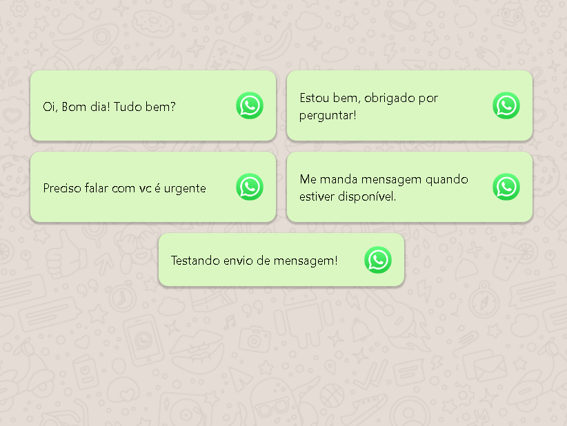

<p align="center">
  
  <a href="https://www.twitter.com/verasdan/">
    
  </a>
  <a href="https://github.com/verasdan/Project-Auto-Msg/commits/master">
    
  </a>
  
   <a href="https://github.com/verasdan/Project-Auto-Msg/stargazers">
    
  </a>

</p>

<h4 align="center"> 
	 ♻️ Concluído
</h4>

---

<p align="center">
  <a href="#-sobre-o-projeto">Sobre</a> •
  <a href="#-funcionalidades">Funcionalidades</a> •
  <a href="#-layout">Layout</a> • 
  <a href="#-como-executar-o-projeto">Como executar</a> • 
  <a href="#-tecnologias">Tecnologias</a> •
  <a href="#-autor">Autor</a> • 
  <a href="#user-content--licença">Licença</a>
</p>

## 💻 Sobre o projeto

Projeto Auto Msg - é uma ferramenta de automação feita em JavaScript para envio de mensagens ja definidas através da plataforma do Whatsapp Web.

---

## ⚙️ Funcionalidades

- [x] Envio de mensagens padronizadas através do Whatsapp Web.

---

## 🎨 Layout - Web

<p align="center" style="display: flex; align-items: flex-start; justify-content: center;">
  
</p>

---

## 🚀 Como executar o projeto

```bash

# Clone este repositório
$ git clone git@github.com:verasdan/Project-Auto-Msg.git

```

---

## 🛠 Tecnologias

As seguintes ferramentas foram usadas na construção do projeto:

#### **Website**  

-   **Html**
-   **CSS**
-   **JavaScript**
-   Editor:  **[Visual Studio Code](https://code.visualstudio.com/)**

---

## 💪 Como contribuir para o projeto

1. Faça um **fork** do projeto.
2. Crie uma nova branch com as suas alterações: `git checkout -b my-feature`
3. Salve as alterações e crie uma mensagem de commit contando o que você fez: `git commit -m "feature: My new feature"`
4. Envie as suas alterações: `git push origin my-feature`
> Caso tenha alguma dúvida confira este [guia de como contribuir no GitHub](./CONTRIBUTING.md)

---

## 🦸 Autor

<a href="https://github.com/verasdan">
 
 <br />
 <sub><b>Dan Veras</b></sub></a> <a href="https://github.com/verasdan" title="">🚀</a>
 <br />

[](https://twitter.com/veras_dan) [](https://www.linkedin.com/in/verasdanilo/) 
[](mailto:veras_dan@hotmail.com)

---

## 📝 Licença

Este projeto esta sobe a licença [MIT](./LICENSE).

Feito com ❤️ por Dan Veras 👋🏽 [Entre em contato!](https://www.linkedin.com/in/verasdanilo/)

---